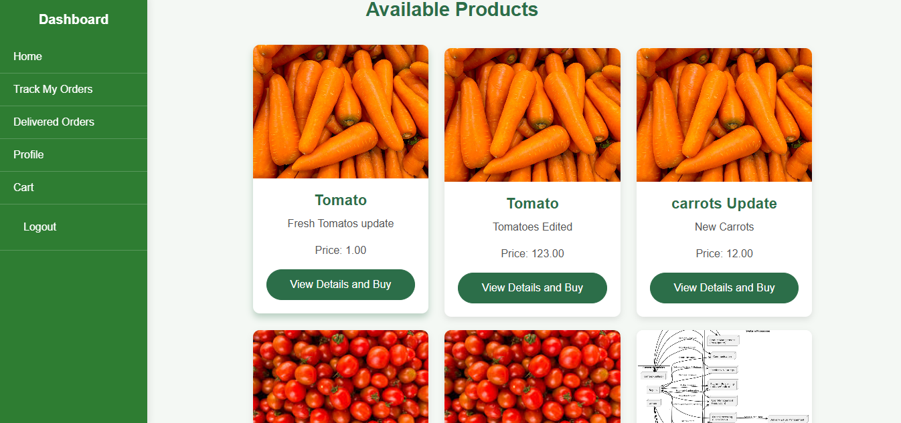
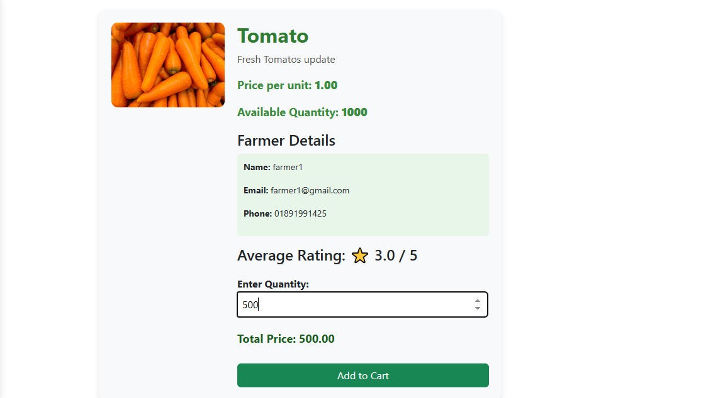

# Krishi Bazaar
### A Local Farmer Marketplace

Krishi Bazaar is a web-based agricultural marketplace that connects **farmers directly with buyers**, eliminating unnecessary intermediaries and improving transparency in agricultural trade.  

The platform enables farmers to list products, buyers to place orders, and administrators to manage logistics through a **hub-based delivery network** designed to support inter-city agricultural distribution.

This project was developed as part of the **Information System Design & Software Engineering Lab (CSE3224)** course at **Ahsanullah University of Science and Technology (AUST)**.

---

# Table of Contents

- Overview
- Features
- System Architecture
- Database Design
- Logistics Model
- Technology Stack
- Project Structure
- Installation
- Usage
- Screenshots
- Future Improvements
- License

---

# Overview

Agricultural markets often involve multiple intermediaries, which reduces profit margins for farmers and increases prices for consumers.  

Krishi Bazaar addresses this problem by providing a **digital marketplace where farmers can directly sell products to buyers** while integrating a structured **hub-based logistics system** to ensure efficient delivery.

The system includes modules for:

- User registration and authentication
- Product management
- Order processing
- Payment tracking
- Delivery management
- Product reviews and ratings

---

# Features

## User Management
- Buyer and farmer registration
- Login authentication
- Profile management
- Location-based address storage

## Product Marketplace
- Farmers can upload agricultural products
- Category-based product organization
- Product descriptions and photos
- Price and quantity management

## Order Processing
- Buyers can purchase products
- Automatic price calculation
- Order tracking system
- Order status management

## Payment Tracking
- Payment records stored per order
- Payment method tracking
- Payment status verification

## Review and Rating System
- Buyers can review purchased products
- Rating system for product quality
- Feedback mechanism for marketplace improvement

## Hub-Based Delivery System
A multi-stage logistics network enables efficient distribution across regions using **Primary and Secondary hubs**.

Delivery stages include:

1. Seller → Nearby Secondary Hub  
2. Secondary Hub → Primary Hub  
3. Inter-city hub transfer  
4. Primary Hub → Buyer-side Secondary Hub  
5. Last-mile delivery to customer

---

# System Architecture

The system is divided into several functional modules:
- User Management
- Product Management
- Order Processing
- Payment Processing
- Delivery & Logistics
- Messaging & Feedback
- Admin Control

```
docs/images/system_architecture.png
```


---

# Database Design

The system uses a relational database structure to manage marketplace data.

### Main Entities

| Entity | Description |
|------|------|
| User | Stores buyer and farmer accounts |
| Product | Agricultural products listed by farmers |
| Category | Product classification |
| Order | Order records from buyers |
| Transaction | Payment information |
| Delivery | Delivery tracking data |
| Location | Geographic address data |
| PrimaryHub | Major logistics hubs |
| SecondaryHub | Local distribution hubs |
| RatingAndReview | Product feedback |
| UserMessage | Communication between users |
| Admin | Administrative access |

### ER Diagram
```
docs/images/database_schema.png
```

# Logistics Model

Krishi Bazaar uses a **hub-based logistics architecture** to support efficient delivery across different regions.

The process flow:
```
Farmer
↓
Secondary Hub (Seller Region)
↓
Primary Hub
↓
Primary Hub (Destination City)
↓
Secondary Hub (Buyer Region)
↓
Customer Delivery
```


---

# Technology Stack

| Layer | Technology |
|------|------|
| Backend | ASP.NET |
| Language | C# |
| Framework | .NET |
| Database | SQL Server |
| IDE | Visual Studio 2022 |
| Version Control | Git |
| Repository Hosting | GitHub |

---

# Project Structure
```
KrishiBazaar
│
├── Controllers
├── Models
├── Views
├── Database
│
├── wwwroot
│   ├── css
│   ├── js
│   └── images
│
├── docs
│   └── images
│
├── README.md
├── KrishiBazaar.sln
└── .gitignore
```


---

# Installation

Clone the repository

```bash
git clone https://github.com/yourusername/krishi-bazaar.git
```
Open the solution

- Open KrishiBazaar.sln in Visual Studio 2022

Restore dependencies

```bash
dotnet restore
```
Run the project

```bash
dotnet run
```

# Usage

1. Register as a **Farmer** or **Buyer**
2. Farmers upload agricultural products
3. Buyers browse products and place orders
4. Orders are processed through the hub-based logistics system
5. Buyers receive delivery
6. Buyers can review and rate products

# Screenshots

## Homepage

docs/images/homepage.png



---

## Product Listing

docs/images/product_listing.png



---

## Order Management

docs/images/order_management.png


---

## Delivery Tracking

docs/images/delivery_tracking.png


# Future Improvements

- Real-time delivery tracking
- Secure Communication between sellers and buyers
- Mobile application integration  
- AI-based demand prediction for farmers  
- Smart logistics route optimization  
- Automated hub capacity management  
- Secure payment gateway integration


